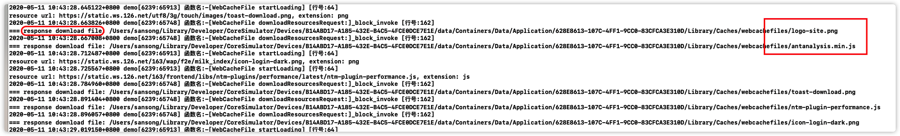
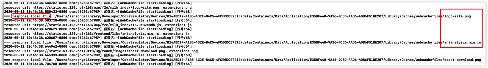

# WebCacheFile

Cache the web file locally for faster access next time. 

缓存web文件到本地以提高下次访问速度。

[WKWebView 的优化思考](https://github.com/stelalae/blog/blob/master/iOS/WKWebView.md)

## 安装

该库最低支持 iOS 9.0 和 Xcode 11。

### CocoaPods

1. 在 Podfile 中添加 pod 'WebCacheFile'。
2. 执行 pod install 或 pod update。
3. 导入 <WebCacheFile/WebCacheFile.h>。

### 手动安装

1. 下载 WebCacheFile 文件夹内的所有内容。
2. 将 WebCacheFile 内的源文件添加(拖放)到你的工程。
3. 导入 WebCacheFile.h。

## 使用

```
@implementation WkViewController

- (void)viewDidLoad {
  [super viewDidLoad];
  
  // 1.注册需要拦截的协议类型
  [WebCacheFile initRegister:@[@"http", @"https"]];
  
  // 2.
  [WebCacheFile setInterceptResourceTypes:@[@"js", @"css", @"png", @"jpg", @"gif"]];
  // [self addWKWebView];
}

- (void)dealloc {
  [WebCacheFile unregister];
}

@end
```

代码中已有Demo工程，可下载下来运行。示例截图：

第一次加载，会去下载。


第2+次加载，直接返回本地文件数据。


注意，对于在WkWebView里 post 请求 body 数据被清空的临时处理方案时，在js层将body数据放入request header中，key固定为`#define WkPostBodyKey @"headerBody"`。

-------

参考资料：
* [IOS 使用NSURLProtocol 拦截网络请求实现缓存](https://blog.csdn.net/bobbob32/article/details/83512069)
* [WKWebView实现网页静态资源优先从本地加载](https://blog.csdn.net/hanhailong18/article/details/79394856)
* [移动 H5 首屏秒开优化方案探讨](http://blog.cnbang.net/tech/3477/)
* [App内网页启动加速实践：静态资源预加载视角](https://zhuanlan.zhihu.com/p/77144845)
* [WKWebView 那些坑](https://mp.weixin.qq.com/s/rhYKLIbXOsUJC_n6dt9UfA?)